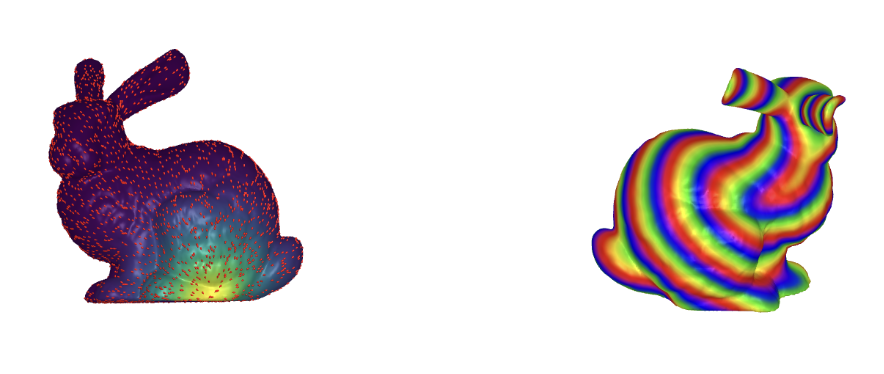

+++
title = "Computing Geodesics on Meshes with Heat"
date = "2023-06-03T20:05:57-05:00"
description = "A short article explaining a beautiful way to estimate geodesics on meshes."

tags = []
draft = true
+++

I created a notebook illustrating an interesting algorithm for computing geodesics by using heat simulation from this paper https://www.cs.cmu.edu/~kmcrane/Projects/HeatMethod/paperCACM.pdf.

You can find the notebook [here](https://ian.limarta.org/HeatMethod/heat_method.html).

Notes:
- To run interactively, either use Binder or preferably download it locally and run it with Julia.
